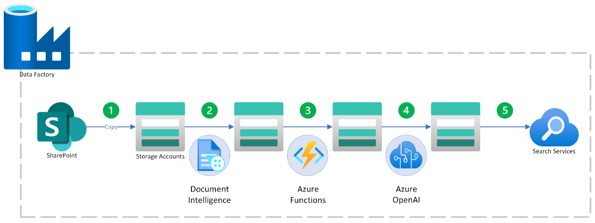

# Chat with Data Reference Architecture  

*Author: Ellie Nosrat, Principal AI Partner Solution Architect*

## Design principles and best practices for building scalable and robust applications using LLMs  

In this document, an architecture and best practices for deploying a chat application with OpenAI in Azure are explained.  
There are three independent processes, each illustrated separately:  
1. **Data ingestion pipeline**  
2. **Real-time web-based chat application**  
3. **LLMOps pipeline**  

---

## Data Ingestion  
### Architecture 1 (Push)  

### Components  
- **Azure Data Factory**: Azure Data Factory allows you to create data pipelines and data flows easily.  
  - A pipeline is a set of activities performed sequentially based on a defined logic.  
  - A data flow is a series of operations performed on input datasets, resulting in one or more output datasets.  
- **SharePoint**: The existing SharePoint source. Admin permission may be required if using App Registration for data access.  
- **Storage Account**:  
  - Temporary storage for intermediate data transformations to improve performance.  
  - A repository for source files to be accessed by users.  
- **Document Intelligence**: Extracts text from various file types. Large documents may require pagination.  
- **Azure OpenAI**:  
  - Used for vectorization and text embedding, converting text into multi-dimensional vectors for improved search.  
  - Can also be used for generating document summaries, keywords, etc.  
- **Azure Functions**: Supports custom logic within Azure Data Factory data flows, such as:  
  - Splitting large documents into multiple chunks.  
  - Adding descriptions for images within documents.  
  - Calling OpenAI functions for generating summaries and keywords.  
  - Injecting metadata into documents.  
- **Azure AI Search (formerly Cognitive Search)**:  
  - Provides a text-based search tool for users.  
  - Supports vector search and non-text filtering/querying.  
  - Stores data in an index, similar to a table in SQL databases.  

### Steps  
1. Copy files from SharePoint to the Storage Account, ensuring only new or modified files are copied.  
2. Submit each file to Document Intelligence and store the resulting JSON file(s) in a temporary storage account.  
3. Perform any necessary data transformations using Azure Functions.  
4. Generate vector embeddings for the text using Azure OpenAI.  
5. Insert the processed data into the AI Search index.  

### Best Practices  
- Include file and chunk metadata in the AI Search index to ensure traceability.  
- Schedule pipeline execution based on file change frequency in SharePoint.  
- Implement logic to detect and delete removed files from SharePoint, Storage Account, and AI Search index.  
- Track and utilize last modified dates to minimize API calls.  
- Consider separate indexes for different document types (e.g., documentation vs. FAQs).  
- If handling multilingual documents, use Azure Translate while keeping the original language in AI Search.  

---

## Real-time Serving  
### Architecture  

### Components  
- **Azure App Service**: Hosts the frontend SPA and backend API.  
- **Azure API Management Services (APIM)**: Protects APIs, enables logging, and supports usage limits to prevent excessive token consumption.  
- **OpenAI Embedding**: Converts user inputs into query vectors for searching.  
- **AI Search**: Retrieves documents related to user prompts.  
- **OpenAI Completion**: Generates final answers based on user prompts and retrieved documents.  
- **CosmosDB**: Stores conversations and collects feedback on LLM performance.  
- **Azure Storage**: Hosts source documents for reference.  
- **Virtual Network (VNet)**: Protects infrastructure.  
- **Entra ID**: Manages authentication and user access.  

### Steps  
1. User accesses frontend and authenticates via Entra ID.  
2. User input is sent to the API, which generates embeddings using OpenAI.  
3. API performs a vector or semantic search using AI Search.  
4. API sends relevant documents and conversation history to OpenAI Completion.  
5. Response is generated, stored in CosmosDB, and sent to the user.  
6. Reference document URLs are sent to users via SAS tokens.  

### Best Practices  
- Enforce APIM limits to prevent excessive API usage.  
- Use the same vectorization method as the data ingestion pipeline.  
- Notify users that conversations are recorded and provide a way to delete history.  
- Ensure files stored in Azure Storage are not publicly accessible. Use short-lived SAS tokens for access.  
- Enable logging for all services via Application Insights/Log Analytics.  
- Keep programming logic separate from LLM prompt logic.  
- Consider using multiple GPT models for different tasks (e.g., GPT-3.5 for summaries, GPT-4 for responses).  

---

## LLMOps  
LLMOps ensures that the LLM-based application remains relevant and accurate as user interactions evolve.  

### Components  
- **CosmosDB**: Stores logged conversations and user feedback.  
- **Promptflow**: A lifecycle management tool for LLMOps, allowing experimentation with prompts and evaluation metrics.  
- **Azure AI**: Provides an environment for AI development and collaboration.  

### Steps  
1. Generate a test dataset from CosmosDB historical data.  
2. Run tests against current prompts periodically.  
3. Adjust prompts, model parameters, or LLM versions based on test results.  
4. Deploy the best configuration to production.  

### Best Practices  
- Limit test runs to control token consumption and schedule tests during off-peak hours.  
- When a new model version is released, run tests to compare results.  
- Optimize costs by starting with GPT-4 and testing with GPT-3.5 for feasibility.  
- Monitor LLM accuracy, latency, and user feedback continuously.  
- Design LLMOps with flexibility to adapt to evolving best practices and tools.  

### Design principles and best practices for building scalable and robust applications using LLMs  

In this document, an architecture and best practices for deploying a chat application with OpenAI in Azure are explained.  
There are three independent processes, each illustrated separately:  
1. **Data ingestion pipeline**  
2. **Real-time web-based chat application**  
3. **LLMOps pipeline**  

---

## Data Ingestion  
### Architecture 1 (Push)  

### Components  
- **Azure Data Factory**: Azure Data Factory allows you to create data pipelines and data flows easily.  
  - A pipeline is a set of activities performed sequentially based on a defined logic.  
  - A data flow is a series of operations performed on input datasets, resulting in one or more output datasets.  
- **SharePoint**: The existing SharePoint source. Admin permission may be required if using App Registration for data access.  
- **Storage Account**:  
  - Temporary storage for intermediate data transformations to improve performance.  
  - A repository for source files to be accessed by users.  
- **Document Intelligence**: Extracts text from various file types. Large documents may require pagination.  
- **Azure OpenAI**:  
  - Used for vectorization and text embedding, converting text into multi-dimensional vectors for improved search.  
  - Can also be used for generating document summaries, keywords, etc.  
- **Azure Functions**: Supports custom logic within Azure Data Factory data flows, such as:  
  - Splitting large documents into multiple chunks.  
  - Adding descriptions for images within documents.  
  - Calling OpenAI functions for generating summaries and keywords.  
  - Injecting metadata into documents.  
- **Azure AI Search (formerly Cognitive Search)**:  
  - Provides a text-based search tool for users.  
  - Supports vector search and non-text filtering/querying.  
  - Stores data in an index, similar to a table in SQL databases.  

### Steps  
1. Copy files from SharePoint to the Storage Account, ensuring only new or modified files are copied.  
2. Submit each file to Document Intelligence and store the resulting JSON file(s) in a temporary storage account.  
3. Perform any necessary data transformations using Azure Functions.  
4. Generate vector embeddings for the text using Azure OpenAI.  
5. Insert the processed data into the AI Search index.  

> [!NOTE]  
> If the solution is expanded to multiple scopes, e.g., wealth management, tax, …, you can create the additional pipelines and/or data flows in the same ADF instance. Azure AI Search can be shared as well (create a new index for each new use case).
Depending on the nature of the tasks, separating Azure Functions may be a better idea.

### Best Practices  
- Include file and chunk metadata in your AI Search index to ensure that each chunk is traceable back to the original document in SharePoint or the copy of the raw file on Azure Storage. 
- Schedule the pipeline to execute regularly based on the frequency of file change at source (SharePoint).  
- Implement a logic to detect deleted files from SharePoint to delete them from the Storage Account and AI Search index.
- Remember that if for any reason, such as confidentiality, a file is deleted from the source (SharePoint), at least two copies of it are still available in your storage account and in your AI Search index.
- Keep track and utilize last modified date of files to minimize API calls on subsequent steps. 
- If there are different types of documents, consider creating different indexes to improve the results. For example, if some files are documentations, and some are FAQs, your chatbot may perform better if this information is provided to it as two separate data sources.
- If documents are in multiple languages, use Azure translate to translate them to English. But keep the original language in your AI index as well. If there are many documents in other languages, you may want to create one index per language or one field per language, because the search algorithms in AI Search are language dependent. Vectorization may overcome some of the issues, since vector embeddings are not language dependent I theory, however in practice, there are performance drops when working with documents in multiple languages. See [AI Search recommendations for handling multi-language docs](https://learn.microsoft.com/en-us/azure/search/search-language-support`).
- Utilize the capabilities of Microsoft Graph API when working with SharePoint files. 

---

## Real-time Serving  
### Architecture  

### Components  
- **Azure App Service**: Hosts the frontend SPA and backend API.  
- **Azure API Management Services (APIM)**: Protects APIs, enables logging, and supports usage limits to prevent excessive token consumption.  
- **OpenAI Embedding**: Converts user inputs into query vectors for searching.  
- **AI Search**: Retrieves documents related to user prompts.  
- **OpenAI Completion**: Generates final answers based on user prompts and retrieved documents.  
- **CosmosDB**: Stores conversations and collects feedback on LLM performance.  
- **Azure Storage**: Hosts source documents for reference.  
- **Virtual Network (VNet)**: Protects infrastructure.  
- **Entra ID**: Manages authentication and user access.  

### Steps  
1. User accesses frontend and authenticates via Entra ID.  
2. User input is sent to the API, which generates embeddings using OpenAI.  
3. API performs a vector or semantic search using AI Search.  
4. API sends relevant documents and conversation history to OpenAI Completion.  
5. Response is generated, stored in CosmosDB, and sent to the user.  
6. Reference document URLs are sent to users via SAS tokens.  

### Best Practices  
- APIM limit capacity
- For vectorization of users’ queries, you must call the same vectorizer that was used in data ingestion pipeline.
- When logging messages in Cosmosdb, notify the users that conversations are being recorded. Allow a mechanism for the user’s to delete the conversations. Implement a middleware to redact confidential/PII/… information. Include the files or file IDs that were injected as source in the RAG pattern for future tracing.
- When hosting files from Storage account, make sure the storage does not have public access on. Have your API generate a SAS token for the document(s) needed and send the link to the user. Make SAS tokens short-lived (e.g., 1 hour). If user’s often visit previous chats and click on references, allow for renewing/regenerating SAS tokens, or an alternate mechanism to access files.
- Make sure users are authenticated and authorized.
- Enable logging for all services in Application Insights/Log Analytics.
- Prioritize access between API and other resources using Managed Identities when possible.
- Keep programming logic separate from LLM prompts/logic. Usually prompts will be modified/tuned by non-programmers.
- You can utilize multiple GPT models in the same app. For instance, you can use GPT 3.5 for summarizing the conversation and GPT 4 for generating the final answer.
 

---

## LLMOps  
LLMOps ensures that the LLM-based application remains relevant and accurate as user interactions evolve.  

### Components  
- **CosmosDB**: Stores logged conversations and user feedback.  
- **Promptflow**: A lifecycle management tool for LLMOps, allowing experimentation with prompts and evaluation metrics.  
- **Azure AI**: Provides an environment for AI development and collaboration.  

### Steps  
1. Generate a test dataset from CosmosDB historical data.  
2. Run tests against current prompts periodically.  
3. Adjust prompts, model parameters, or LLM versions based on test results.  
4. Deploy the best configuration to production.  

### Best Practices  
- Testing will consume tokens and incur charges. Make sure to run the tests with limits (e.g., select no more than 100 records from cosmosDB). Also, schedule the jobs to run during off-peak hours, so that the app has enough token quota to support users.
- When a new version for a model is published (such as v1106 for GPT-3.5), always run your tests with everything the same except for the model upgraded to the new version. 
- To optimize for cost, start with the more expensive model (e.g., GPT-4), and if the performance is desired, re-run the tests with a lower model (e.g., GPT-3.5).
- When choosing between GPT 3.5 and 4, consider latency as well as cost and accuracy.
- LLMOps is still very new. Best practices are still being discovered by developers. Design your LLMOps pipeline with flexibility as approaches may change and new tools may become available.

